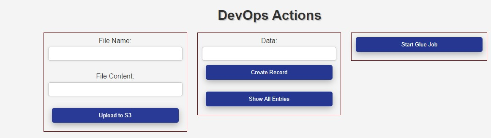
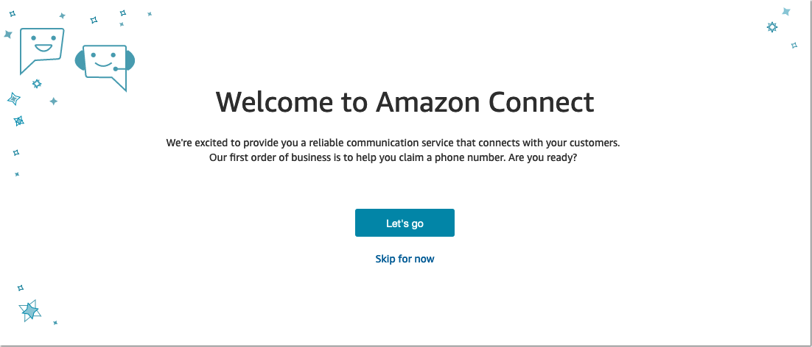
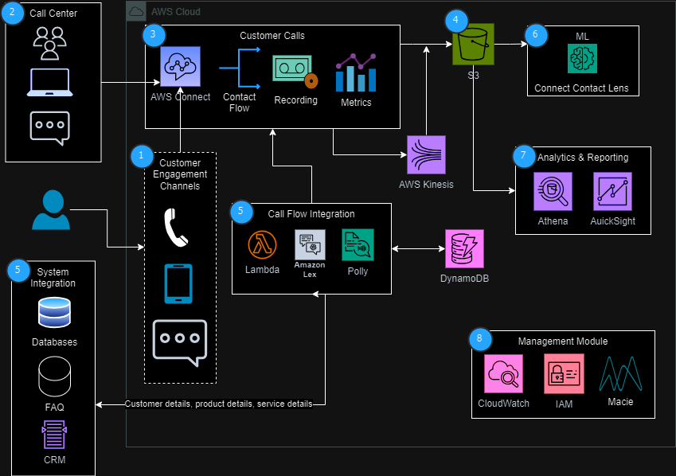
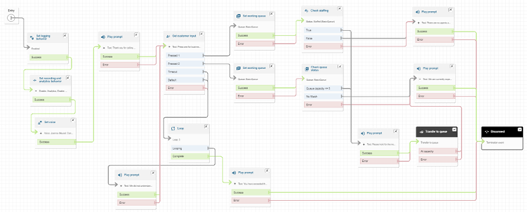
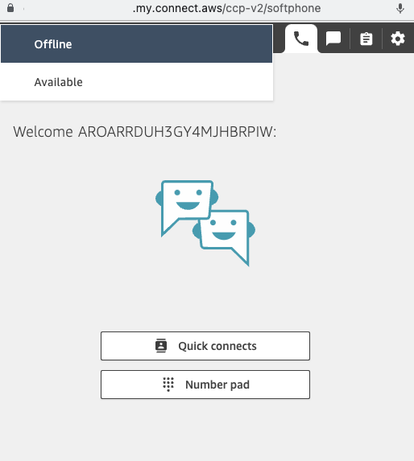
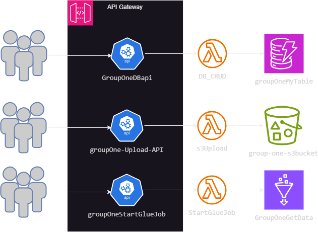
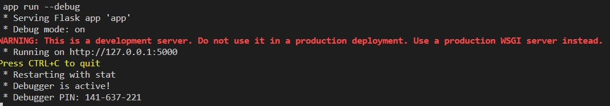

# Provioning AWS resources using Terraform


#### Table of content:
1. [Overview](#overview)
2. [Background](#background)
3. [Project Structure](#project-structure)
4. [Call Center Application using AWS Connect](#call-center-application-using-aws-connect)
5. [Architectural Diagramm](#architectural-diagramm)
6. [Call Center Agent Dashboard](#call-center-agent-dashboard)
7. [Provisioning using Terraform](#provisioning-using-terraform)
8. [Setting up FrontEnd](#setting-up-frontEnd)
9. [Installation of Required Packages](#installation-of-required-packages)
10. [Installation of Flask](#installation-of-flask)
11. [Contributors](#contributors)
12. [License](#license)


## Overview
This project demonstrates the capabilities of Terraform by provisioning various AWS resources. The key components include API Gateway, Lambda Functions, Glue Job, DynamoDB, and an S3 Bucket

## Background

We leverage Terraform to showcase its effectiveness by provisioning the following AWS resources:

- API Gateways: Three APIs are provisioned.
- Lambda Functions: Three Lambda functions are provisioned.
- Glue Job
- DynamoDB
- S3 Bucket

To test these resources, we provide a FrontEnd application that allows you to interact with the functionalities of the APIs.

## Project Structure
All work files are organized within the "Projects" directory:

- FrontEnd: Contains HTML and Python code showcasing API functionalities.
- Terraform: Holds all Terraform code for provisioning AWS resources.
- CC (Call Center): Documentation on infrastructure provisioning using AWS Connect.


## Call Center Application using AWS Connect

<div style="text-align:center;">    
    
</div>

### Architectural Diagramm



### Call Flow Diagram



### Call Center Agent Dashboard
<div style="text-align:center;">    
    
</div>

We have included a lab to kick start the project, providing a solid starting point that you can customize to meet your requirements. You can access the lab [here](https://catalog.us-east-1.prod.workshops.aws/workshops/d1f03aa4-9605-4925-aa18-e82819feb069/en-US).


# Provisioning using Terraform

<div style="text-align:center;">    
    
</div>

The [Terraform](/Terraform/ )directory contains all the necessary Terraform code to provision the required AWS resources for this workshop.


# Setting up FrontEnd

The FrontEnd uses Flask to render the web page, and the back end code is written in Python. Follow these steps to set it up:

1. Directory structure:
    ```
       /Parent directory
          /FronEnd
            /templates
    ```

2. Place Python code in the **'/FrontEnd'** directory and HTML files in the **'/templates'** directory.
3. Clone the FrontEnd directory to the EC2 instance using **'git clone'**.
4. Start the Flask server with the command:
    `flask --app app run --debug` or
    `python3 app.py`


This will start the application. The screen will look like as follow.


5. Obtain the public IP address of the EC2 instance and access the application in a web browser.
6. The port for this will be '8080' if you use to access the application through public IP.

<div style="text-align:center;">    
    
</div>


### Installation of Required Packages

Connecting to EC2 Instance:
- Use SSH to connect to the EC2 instance:
    `ssh -i "key-pair.pem" ec2-user@your-instance-ip`

Update Package Manager
- Update the package manager before installing any packages:
    `sudo yum update -y`

- Install Python PIP
    `sudo yum install python3-pip -y`

- Install Python3
    `sudo yum install python3 -y`

- Verify Installation:
    `python3 --version`


### Installation of Flask
- Use 'pip' to install Flask
    `pip3 install Flask`

- Verify Flask installation
    `flask --version`


## Contributors
●   **Project Manager:** Sarvan Veluppillai   
●	**Cloud Architect:** Zikora Orakwe   
●	**Developers:** Ammar Ahmad, sarvan Veluppillai  
●	**AWS Account Manager:** Jing Yu  


## License

This project is licensed under the [GPL-3.0] License - see the [LICENSE](LICENSE) file for details.
